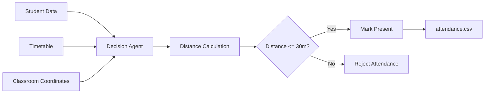

```mermaid
flowchart LR
A[Student Data] --> D[Decision Agent]
B[Timetable] --> D
C[Classroom Coordinates] --> D
D --> E[Distance Calculation]
E --> F{Distance <= 30m?}
F -->|Yes| G[Mark Present]
F -->|No| H[Reject Attendance]
G --> I[attendance.csv]
```